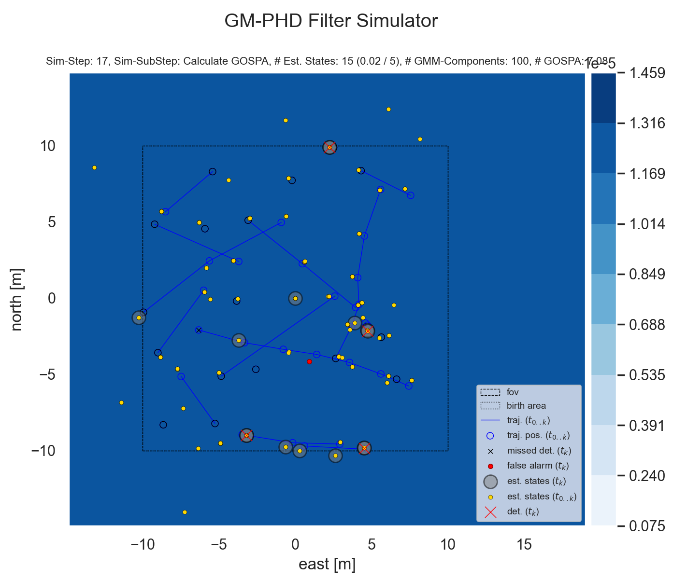
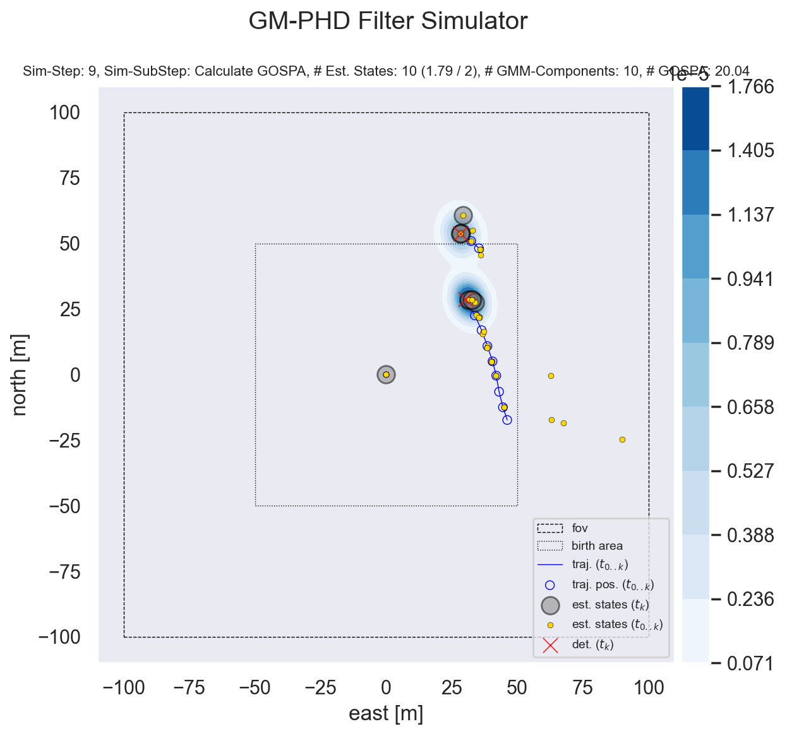
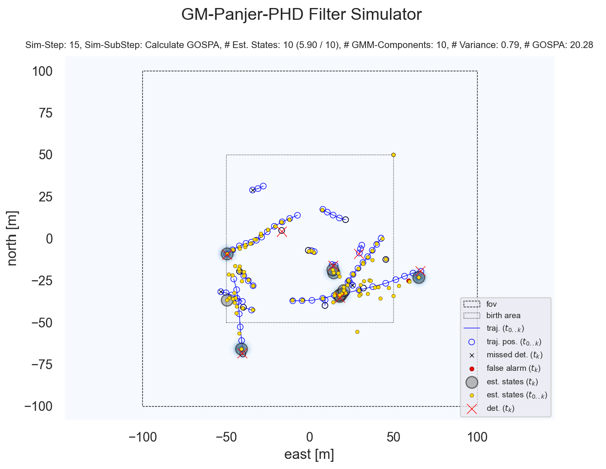
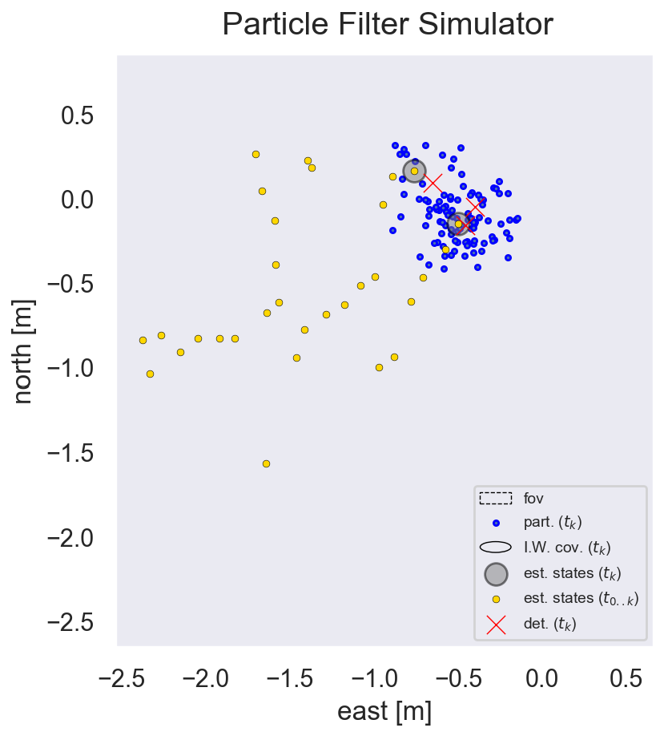

# Filter Simulator
A simulator that simulates events, measurements and filtering.

## Install
### Create a conda environment
```bash
conda init bash # => Open new terminal
conda create --name filter_simulator python=3.7
conda install --name filter_simulator numpy
conda install --name filter_simulator scipy
conda install --name filter_simulator tk
conda install --name filter_simulator matplotlib
conda install --name filter_simulator seaborn
conda install --name filter_simulator scikit-learn
conda install --name filter_simulator pymap3d
conda install --name filter_simulator pykwalify
conda install --name filter_simulator PyYAML
```

### Activate the conda environment and start a program (e.g. PHD filter in this case)
```bash
cd filter_simulator/
conda activate filter_simulator
./gm_phd_filter_simulator.py --data_provider="DataProviderType.SIMULATOR" --sim_t_max=50 --limits_mode=LimitsMode.ALL_DETECTIONS_FIXED_UPDATE --birth_gmm="[GmComponent(0.1, np.zeros(4), np.diag(np.repeat(10000., 4)))]" --p_survival=0.9 --p_detection=0.9 --transition_model=TransitionModel.PCW_CONST_WHITE_ACC_MODEL_2xND --delta_t=1.0 --mat_f="np.block([[np.eye(2), np.eye(2)], [np.eye(2) * 0., np.eye(2)]])" --mat_q="np.eye(4) * 0." --mat_h="np.block([np.eye(2), np.eye(2) *0.])" --mat_r="np.eye(2) * 10.1" --sigma_vel_x=3. --sigma_vel_y=3. --sigma_accel_x=.7 --sigma_accel_y=.7 --trunc_thresh=1e-6 --merge_thresh=1e-2 --max_components=100 --ext_states_bias=1000. --ext_states_use_integral=1 --density_draw_style=DensityDrawStyle.KDE --n_samples_density_map=1000 --n_bins_density_map=100 --draw_layers="[layer for layer in DrawLayer if not layer == DrawLayer.GMM_COV_ELL and not layer == DrawLayer.GMM_COV_MEAN and not layer == DrawLayer.ALL_DET_CONN]"
```

## Create documentation
1. First make sure, the necessary tools are installed and accessible in the environment.
  * strip-hints
  * conda / activate
  * epydoc
  * graphviz

2. Strip type hints, since the used tool cannot handle it
```bash
find . -type f -name '*.py' -print0 | xargs --null -I{} bash -c 'strip-hints --no-ast {} > $(dirname {})/__xxx__$(basename {}); mv $(dirname {})/__xxx__$(basename {}) $(dirname {})/$(basename {})' \;
```

3. Show the list of conda environments
```bash
conda env list
```

4. Activate that environment, that belongs to the project. This is necessary to provide the epydoc tool all modules.
```bash
activate /opt/anaconda3/envs/particle_filter.py
```

5. Get all files in the project folder and pass it to the epydoc tool, which then generates the output document. Unfortunately the tool needs to be called once per output type.
```bash
find . -name '*.py' -exec epydoc --html --graph=all {} +
find . -name '*.py' -exec epydoc --pdf --graph=all {} +
```

## ToDos
* Use "import logging" instead of own logging system?


## Here are some screenshots on what is possible
### GM-PHD filter

Run-command:
```./gm_phd_filter_simulator.py --data_provider="DataProviderType.SIMULATOR" --sim_t_max=50 --limits_mode=LimitsMode.ALL_DETECTIONS_FIXED_UPDATE --birth_gmm="[GmComponent(0.1, np.zeros(4), np.diag(np.repeat(10000., 4)))]" --p_survival=0.9 --p_detection=0.9 --transition_model=TransitionModel.PCW_CONST_WHITE_ACC_MODEL_2xND --delta_t=1.0 --mat_f="np.block([[np.eye(2), np.eye(2)], [np.eye(2) * 0., np.eye(2)]])" --mat_q="np.eye(4) * 0." --mat_h="np.block([np.eye(2), np.eye(2) *0.])" --mat_r="np.eye(2) * 10.1" --sigma_vel_x=3. --sigma_vel_y=3. --sigma_accel_x=.7 --sigma_accel_y=.7 --trunc_thresh=1e-6 --merge_thresh=1e-2 --max_components=100 --ext_states_bias=1000. --ext_states_use_integral=1 --density_draw_style=DensityDrawStyle.KDE --n_samples_density_map=1000 --n_bins_density_map=100 --draw_layers="[layer for layer in DrawLayer if not layer == DrawLayer.GMM_COV_ELL and not layer == DrawLayer.GMM_COV_MEAN and not layer == DrawLayer.ALL_DET_CONN]"```


Run-command:
```./gm_phd_filter_simulator.py --data_provider="DataProviderType.SIMULATOR" --input_coord_system_conversion="CoordSysConv.WGS84" --output_coord_system_conversion="CoordSysConv.WGS84" --_input_coord_system_conversion="CoordSysConv.ENU" --output_coord_system_conversion="CoordSysConv.ENU" --_output_video="phd_fitler_sim_??.mp4" --observer_position 0 0 --verbosity=Logging.INFO --sim_t_max=50 --fov -100 -100 100 100 --birth_area -50 -50 50 50 --limits_mode=LimitsMode.FOV_INIT_ONLY --birth_gmm="[GmComponent(0.1, np.zeros(4), np.diag(np.repeat(10000., 4)))]" --p_survival=0.9 --p_detection=0.9 --transition_model=TransitionModel.PCW_CONST_WHITE_ACC_MODEL_2xND --delta_t=1.0 --mat_f="np.block([[np.eye(2), np.eye(2)], [np.eye(2) * 0., np.eye(2)]])" --mat_q="np.eye(4) * 0." --mat_h="np.block([np.eye(2), np.eye(2) *0.])" --mat_r="np.eye(2) * 10.1" --sigma_vel_x=3. --sigma_vel_y=3. --sigma_accel_x=.7 --sigma_accel_y=.7 --clutter=1 --trunc_thresh=1e-6 --merge_dist_measure=DistMeasure.HELLINGER --merge_thresh=1e-2 --max_components=100 --ext_states_bias=1000. --ext_states_use_integral=1 --density_draw_style=DensityDrawStyle.KDE --n_samples_density_map=1000 --n_bins_density_map=300 --_draw_layers="[layer for layer in DrawLayer]" --input=detections/manual_3_targets_split_merge.det --auto_step_interval=0 --_sim_t_max=10 --max_components=10 --_draw_layers="[DrawLayer.UNTIL_TRAJ_LINE, DrawLayer.UNTIL_TRAJ_POS]" --_init_kbd_cmds="['l', 'l 0', 'l']" --_data_provider="DataProviderType.FILE_READER" --input=scene_data.yaml_0000 --input=scenario_data_0000.yaml --output=scenario_data_??.yaml --gospa_c=10. --gospa_p=2 --_auto_step_autostart=True --_gui=False --_init_kbd_cmds="['p g']" --init_kbd_cmds="['h']"```

### GM-Panjer-PHD filter

Run-command:
```./gm_panjer_phd_filter_simulator.py --data_provider="DataProviderType.SIMULATOR" --input_coord_system_conversion="CoordSysConv.WGS84" --output_coord_system_conversion="CoordSysConv.ENU" --observer_position 0 0 --verbosity=Logging.INFO --sim_t_max=50 --fov -100 -100 100 100 --birth_area -50 -50 50 50 --limits_mode=LimitsMode.FOV_INIT_ONLY --birth_gmm="[GmComponent(0.1, np.asarray([50, 50, 0, 0]), np.eye(4)*10000.)]" --p_survival=0.9 --p_detection=0.9 --transition_model=TransitionModel.PCW_CONST_WHITE_ACC_MODEL_2xND --delta_t=1.0 --mat_f="np.block([[np.eye(2), np.eye(2)], [np.eye(2) * 0., np.eye(2)]])" --mat_q="np.eye(4) * 0." --mat_h="np.block([np.eye(2), np.eye(2) *0.])" --mat_r="np.eye(2) * 10.1" --sigma_vel_x=3. --sigma_vel_y=3. --sigma_accel_x=.7 --sigma_accel_y=.7 --clutter=10 --trunc_thresh=1e-6 --merge_dist_measure=DistMeasure.HELLINGER --merge_thresh=1e-2 --ext_states_bias=1000. --ext_states_use_integral=1 --density_draw_style=DensityDrawStyle.EVAL --n_bins_density_map=100 --max_components=10 --draw_layers="[layer for layer in DrawLayer if layer in (DrawLayer.DENSITY_MAP, DrawLayer.FOV, DrawLayer.BIRTH_AREA, DrawLayer.UNTIL_TRAJ_LINE, DrawLayer.UNTIL_TRAJ_POS, DrawLayer.CUR_MISSED_DET, DrawLayer.CUR_FALSE_ALARM, DrawLayer.CUR_EST_STATE, DrawLayer.UNTIL_EST_STATE, DrawLayer.CUR_DET)]" --gospa_c=10. --gospa_p=2 --_auto_step_autostart=True --init_kbd_cmds="['h']" --show_colorbar=False```

### Particle filter

Run-command:
```./particle_filter_simulator.py --input detections/manual_3_targets_split_merge.yaml -n 10```


## How to use the program (copied from the programs help)
Start the program with `--help` to get a list of all parameters with their description.

Mouse and keyboard events on the plotting window (GUI):

There are two operating modes:
* `SIMULATION` [Default]
* `MANUAL_EDITING`

To switch between these two modes, one needs to click (at least) three times with the LEFT mouse button while holding the CTRL + SHIFT buttons pressed without interruption. Release the keyboard buttons to complete the mode switch.

SIMULATION mode
  In the SIMULATION mode there are following commands:
  * CTRL + RIGHT CLICK: Navigate forwards (load measurement data of the next time step).

MANUAL_EDITING mode
  In the MANUAL_EDITING mode there are following commands:
  * CTRL + LEFT CLICK: Add point to current (time) frame.
  * SHIFT + LEFT CLICK: Add frame.
  * CTRL + RIGHT CLICK: Remove last set point.
  * SHIFT + RIGHT CLICK: Remove last frame.

Any mode
  In any mode there are following commands:
  * CTRL + SHIFT + RIGHT CLICK: Stores the current detections (either created manually or by simulation) to the specified output file. Attention: the plotting window will change its size back to the size where movie writer (which is the one, that creates the video) got instantiated. This is neccessary, since the frame/figure size needs to be constant. However, immediately before saving the video, the window can be resized to the desired size for capturing the next video, since the next movie writer will use this new window size. This way, at the very beginning after starting the program, the window might get resized to the desired size and then a (more or less) empty video might be saved, which starts a new one on the desired size, directly at the beginning of the simulation.
  * CTRL + ALT + SHIFT + RIGHT CLICK: Stores the plot window frames as video, if its filename got specified.
  * CTRL + WHEEL UP: Zooms in.
  * CTRL + WHEEL DOWN: Zooms out.
  * CTRL + LEFT MOUSE DOWN + MOUSE MOVE: Moves the whole scene with the mouse cursor.
  * SHIFT + LEFT CLICK: De-/activate automatic stepping.